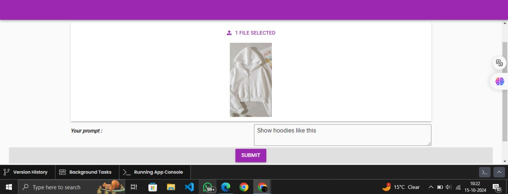

# google_pro_max_lens
Google Lens Pro Max
Overview
Google Lens Pro Max is an intelligent pipeline that processes an image and a user-defined text prompt, returning web search results based on the content of the image and the provided query. This project is designed to handle both image and text inputs, using state-of-the-art models and free-tier web search APIs for generating web results related to the input data.

The goal of this project is to offer a seamless integration of image recognition and text-based search, enabling users to get web results based on visual content and contextual queries.

Features
Image Processing: Extracts key features from images and relates them to a user's query.
Text Query Understanding: Processes user-provided text to improve the accuracy of the web search.
Web Search API Integration: Fetches relevant web search results based on both the image and the prompt.
User-friendly Interface: Easy-to-use command-line interface (CLI) or web interface (if applicable).
Prerequisites
Before you begin, ensure that you have the following installed on your machine:

Python 3.x: The project is built using Python.
Pip: Python package installer.
Git: Version control tool for cloning the repository.
Required Libraries
This project relies on several Python libraries. You can install them using the requirements.txt file.

Installation
Clone the repository:

bash
Copy code
git clone https://github.com/yourusername/google-lens-pro-max.git
cd google-lens-pro-max
Install dependencies:

bash
Copy code
pip install -r requirements.txt
Set up API keys for web search integration. (API key setup instructions are available in the documentation section below.)

Usage
Running the Project
Command-line Interface (CLI): You can use the project through the terminal by passing the image and text prompt.

bash
Copy code
python main.py --image path_to_image --query "your text prompt here"
Replace path_to_image with the path to the image you want to process.
Replace "your text prompt here" with the query you want to use for the web search.
Web Interface (Optional): If a web interface is implemented, you can navigate to http://localhost:5000 in your browser and upload the image and text prompt via the web form.

Example
bash
Copy code
python main.py --image "image_of_a_cat.jpg" --query "What is the breed of this cat?"
This command will process the image of a cat and return search results related to the cat breed based on the image and query.

API Integration
The project uses free-tier search APIs from providers like ExampleSearchAPI.
You need to sign up on the chosen API provider’s platform and get an API key.
Store the API key in a .env file or set it as an environment variable for secure access.
File Structure
The basic structure of the project is as follows:

python
Copy code
google-lens-pro-max/
│
├── data/                # Folder for storing images and datasets
│
├── models/              # Pre-trained models for image processing and feature extraction
│
├── scripts/             # Python scripts for handling image processing, queries, and search results
│   ├── image_processor.py
│   ├── query_processor.py
│   └── web_search.py
│
├── tests/               # Unit tests for validating image processing and query handling
│
├── main.py              # Main script to run the project
├── requirements.txt     # Python dependencies
└── README.md            # Project documentation (this file)
Testing
Unit Tests: This project includes unit tests to ensure the correctness of image processing and query handling. Run the tests using:

bash
Copy code
pytest
Integration Tests: Ensure that the web search integration works correctly by running the system with sample queries and images.

Contributing
Fork the repository.
Create a new branch (git checkout -b feature-name).
Make your changes.
Commit your changes (git commit -am 'Add new feature').
Push to the branch (git push origin feature-name).
Create a new pull request.
License
This project is licensed under the MIT License - see the LICENSE file for details.

